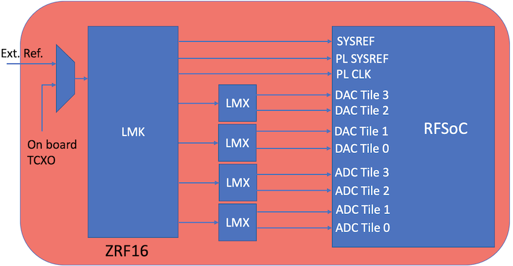
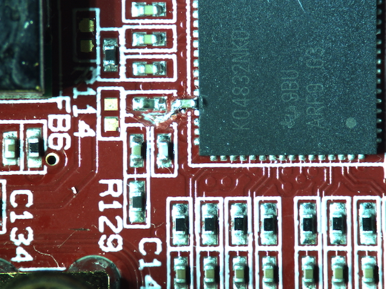

# HTG ZRF16

vendor [link][htg-zrf16]

# RF Clocking
The following figure shows a high-level block diagram for the clocking network:

The PLLs on this board are:
  * LMX04832
  * LMX2594

The distributed hexdump `.txt` file used in the tutorial examples uses the LMK
in single loop mode. This is because of difficulty to lock PLL2 in [dual-loop
mode](#lmk-dual-loop-mode). This requires that a 1.8 Vpp 10 MHz reference clock
from 0.5V and 2.3V be applied to `J19` in these example.

For the 3rd generation `49dr` board supporting clock forwarding the platform
configuration file is by default setup to expect a clock from the connected LMX
chips. This can be changed to use tile clock forwarding by changing the platform
configuration file `adc_clk_src` parameter to the index of the desired source
tile.

# Notes

### Toolflow Compatability 
The distributed images and toolflow support for both generation revisions of
this board have been tested on hardware. However, in the process of casperizing
those boards there were a few board level issues and discrepencies from the
vendor. Should differeing hardware be present on your platform this could
require a few patches to support your board.

### LMK Dual Loop Mode
The examples for this board here configure the LMK to operate in single loop
mode.  There were problems getting PLL1 on the LMK04832 to lock when configured
in dual loop mode. Examining the boards and LMK04832 data sheet indicated that
the `OSCin` pin is not AC coupled using a `0.1 uF` capacitor. Cutting the trace
to add this capacitord an inserting an 0401 `0.1 uF` beettween the `OSCin` pin
and ground did seem to resolve the issue with PLL1 being able to lock when using
the onboard TCXO.

HTG indicates that this has been resolved in later revisions of the board.

### QA
Testing board functionality showed that the FMC had open connections to some of
the GTY transceivers connected. HTG did offer to reflow the board but responding
to have that done there was no response for further instructions.

[htg-zrf16]: http://www.hitechglobal.com/Boards/16ADC-DAC_Zynq_RFSOC.htm
[htg-disclaimers]: ./zrf16#htg-disclaimers
