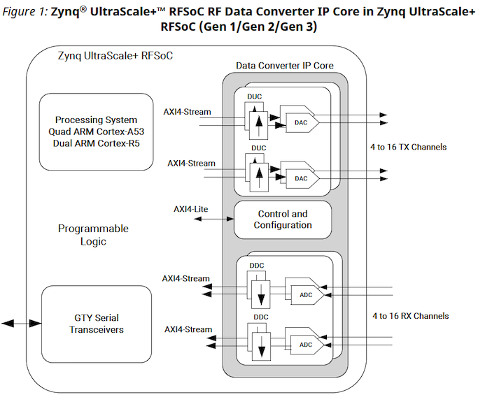
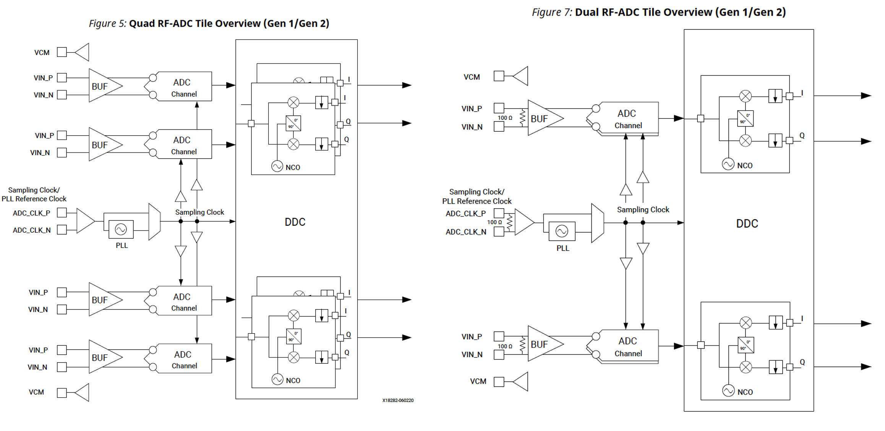
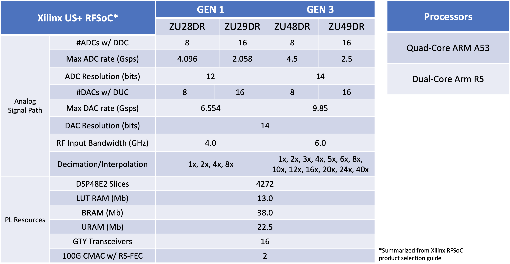

# CASPER RFSoC

# Introduction
The Xilinx Zynq UltraScale+ RFSoC integrates programmable logic with the Zynq
ARM (A53) processor, high speed serial transceivers, and several
multi-gigasample per second ADCs (DACs) capable of digital down (up) conversion
and direct sampling (synthesis) for RF signals up to 6 GHz (9.85). These
features are ideal for small form factor and low power digitizers streaming raw
voltages over 2x100GbE, or suitable as modest sized channelizers using the
available fabric resources. This documentation aims to introduce RFSoC to the
CASPER community along with the platforms and capabilities currently supported
in the CASPER tools. The hardware and design flexibility of RFSoC in CASPER will
continue to proliferate the design philosophy of CASPER of decreasing the
time-to-science metric and provide a way of bringing the needed capabilities to
next generation instruments.

# The RFSoC

The following is a brief overview of the RFSoC architecture and its capabilties.
The primary source of the information presented here is [Xilinx documentation and
data sheets pertaining to the Zynq UltraScale+ RFSoC][xilinx-doc]. Please
reference those materials for more details as this is a rehashing of only some
high-level techincal details.

The IP that is the focus of the RFSoC is the [RF Data Converter][pg269] (RFDC).
A high-level block diagram of the RFSoC architecture with the integration of the
RFDC is shown in the following figure.

The RFDC is a hardened IP core implementing all RF capabilities. Since the
launch of the RFSoC, Xilinx has produced several revisions or "generations" of
the RFSoC product family.

asdlkjlkasd

# Platforms

The CASPER library contains support for the RFDC are 5 RFSoC platforms that have been tested
  * [ZCU216][zcu216]
  * [ZCU111][zcu111]
  * [PYNQ RFSoC 2x2][pynq-rfsoc2x2]
  * [HTG ZRF16-29DR][htg-zrf16] [\*\*][htg-disclaimers]
  * [HTG ZRF16-49DR][htg-zrf16] [\*\*][htg-disclaimers]

# Tutorials
* [Getting Started With RFsoC][getting-started]
* [RFSoC Platform Yellow Block and Simulink Overview][platform-overview]
* [Using the RFDC][rfdc]

## Designs
* [Example Designs][example-designs]

## Xilinx 

[xilinx-doc]: https://www.xilinx.com/products/silicon-devices/soc/rfsoc.html#documentation
[pg269]: https://www.xilinx.com/support/documentation/ip_documentation/usp_rf_data_converter/v2_4/pg269-rf-data-converter.pdf
[zcu216]: https://www.xilinx.com/products/boards-and-kits/zcu216.html
[zcu208]: https://www.xilinx.com/products/boards-and-kits/zcu208.html
[zcu111]: https://www.xilinx.com/products/boards-and-kits/zcu111.html
[htg-zrf16]: http://www.hitechglobal.com/Boards/16ADC-DAC_Zynq_RFSOC.htm
[pynq-rfsoc2x2]: https://www.rfsoc-pynq.io
[htg-disclaimers]: ./htg-disclaimers.md

[getting-started]: ./tut_getting_started.md
[platform-overview]: ./tut_platform.md
[rfdc]: ./tut_rfdc.md
[example-designs]: ./tut_designs/readme.md
