# Tutorial 1: RFSoC Platform and Simulink Overview

In this tutorial, you will make a simple design for an rfsoc board using the CASPER toolflow.
It will take you through launching the toolflow, creating a valid CASPER design in Simulink,
generating an fpg file, programming the fpg file to a CASPER rfsoc board, and interacting with
the running hardware using the casperfpga library through a python interface.

This tutorial assumes that you have already setup your environment correctly, as explained in the
Getting Started With RFSoC tutorial. You should have all the programs and packages installed and 
configuration files set, and you should have successfully set up and tested your connection to the rfsoc board.
The examples in this tutorial were made using Vivado 2020.2 and MATLAB R2020b.

## Creating Your First Design
### Create a New Model
Make sure you are in your previously set up environment and navigate to `mlib_devel`.
**Start Matlab by exectuing `startsg`.** You can execute it in bash as follows:
```bash
$ ./startsg
```

This will properly load the Xilinx and CASPER libraries into Simulink, so
long as your `config.local` file is set correctly. Within Matlab, start Simulink by typing `simulink` into
Matlab's command line. Create a new blank model and save it with an appropriate name.

### Library Organization

There are three primary libraries in Simulink you will use when designing for your rfsoc board:

1. The **CASPER XPS Library** contains the CASPER "Yellow Blocks". These blocks encapsulate interfaces to
your board's hardware (ADCs, memory chips, CPUs, various ports, etc).

2. The **CASPER DSP Library** contains (often green) blocks that implement DSP functions (filters, FFTs, etc).

3. The **Xilinx Library** contains blue blocks which provide low-level fpga functionality (multiplexing,
delaying, adding, etc). It also contains the *System Generator* block, which contains information about the FPGA
you are using.

### Add the Xilinx System Generator and XSG core config blocks
The first thing to add is the *System Generator* block, found using the Simulink Library Browser 
in Xilinx Blockset->Basic Elements->System Generator. Add the block by clicking and dragging the 
block into your design. See the Simulink documentation by mathworks for other methods of finding and adding 
blocks to your design.

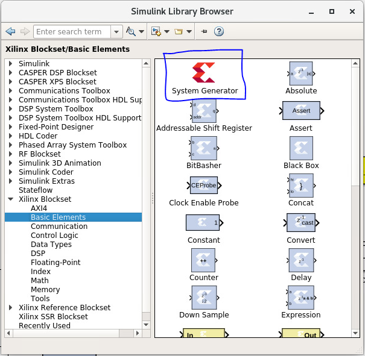

You can double click on the added block to see its configuration. However, instead of configuring the System
Generator ourselves, we will use a platform block from the **CASPER XPS Library** to configure it. Locate the block for the
board you are using in CASPER XPS Blockset->Platforms-><your platform>. This example uses the ZCU216 board, so
this example will add the ZCU216 block.

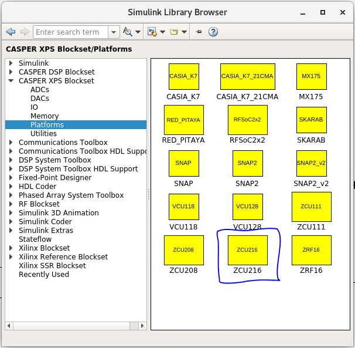

Double click on the added platform block to see its configuration. Confirm that the Hardware Platform parameter matches
the platform you are using. From here, you can also configure other options, such as the board clocks.

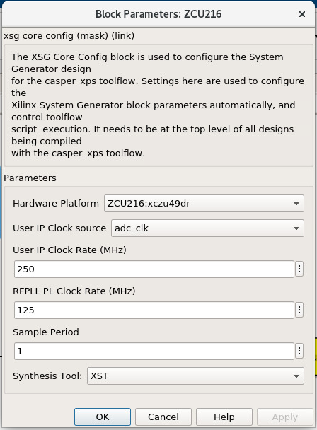

Note: The platform blocks for the various rfsoc boards are configured to use the adc clocks. See the relevant tutorial
on those for more information (to be written).

This yellow platform block will automatically configure the System Generator block for you, and we can now move on to
the design.

Note: **The System Generator and XPS platform blocks are required by all CASPER designs**

### The Example Design
In order to demonstrate the basic use of hardware interfaces and software interaction, this design will implement 3 
different functions on the board:

1. A Flashing LED
2. A Software Controllable Counter
3. A Software Controllable Adder

The final design will look something like this:


### Function 1: Flashing LED
We can create a flashing LED by using a 27 bit counter. On the ZCU216, the default clock given by its CASPER platform
block is 250 MHz, which will toggle the most significant bit on the 27 bit counter about every 0.27 seconds. The 
principle is the same for any clock rate on any board. We can output this most significant bit to an LED on the board,
causing the LED to flash at about 50% duty cycle every so many seconds (half a second for this example).

#### Step 1: Add a counter
Add a blue counter block to the design. It can be found in Xilinx Blockset->Basic Elements->Counter.

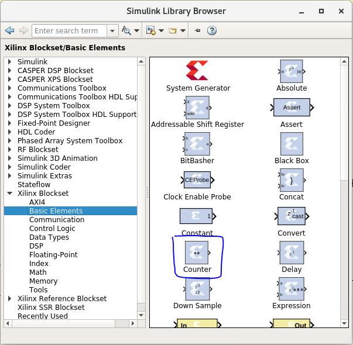

Double click the block to access its parameters, and set it to free running, 27 bits, unsigned. This will set the
counter to count from 0 to (2^27)-1, wrap back to zero, and continue.

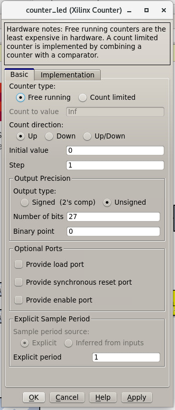

#### Step 2: Add a slice block to select the MSB
Now that we have a counter, we want to select just the most significant bit so that we can send it to an LED. Do this
by adding a blue slice block, found in Xilinx BLockset->Basic Elements->Slice.

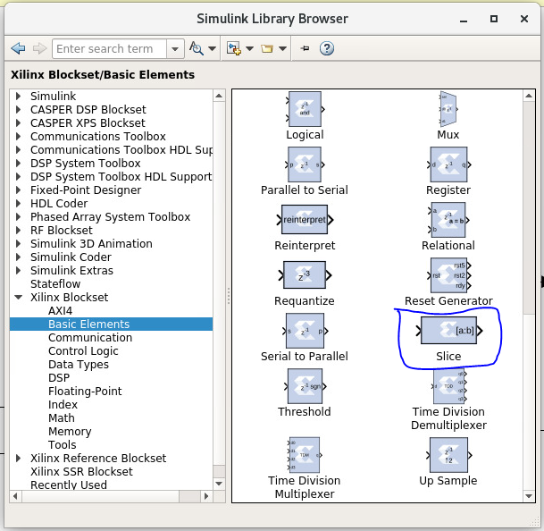

Double click on the slice block to modify it. There are several ways to use the slice block to grab the bit we want.
For this example, we will select the msb by indexing from the upper end and selecting the first bit.

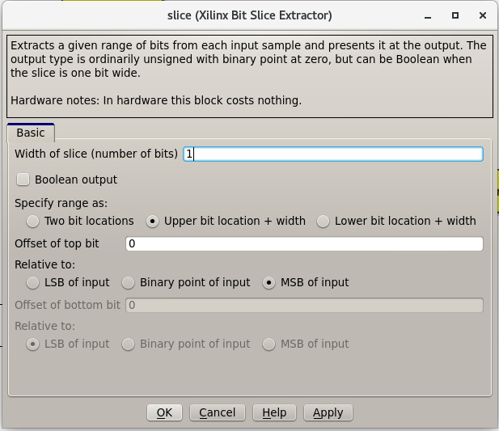

#### Step 3: Add a GPIO Block
Next we want to access an LED to send that bit to. We can access the correct FPGA output pin by using a GPIO block.
GPIO blocks allow you to route signals from Simulink to various FPGA pins. Add a yellow GPIO block, found in 
CASPER XPS Library->IO->gpio.

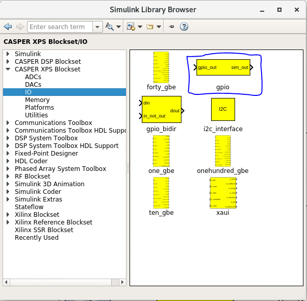

Double click the gpio block and set it to the led I/O group. Set the I/O direction to out, the data type to boolean,
the data bitwidth to 1, and the GPIO bit index to 0. This tells the toolflow that it will be connecting a 1 bit input
to LED0.

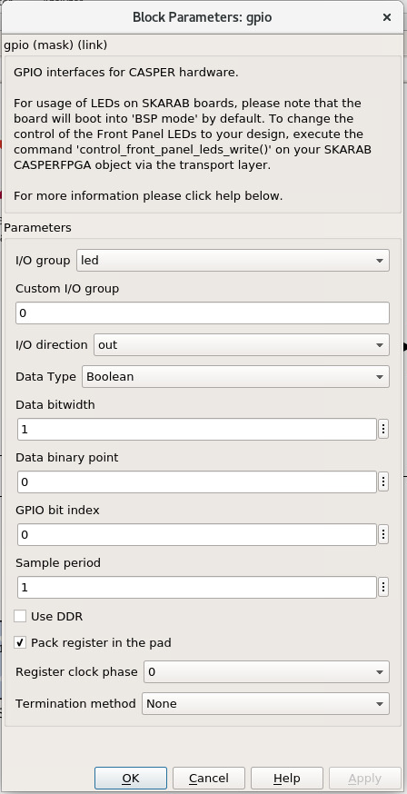

#### Step 4: Add a terminator
To prevent warnings (from MATLAB & Simulink) about unconnected outputs, terminate all unused outputs using a 
*Terminator* block. 

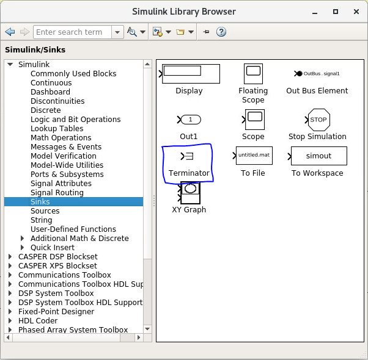

#### Step 5: Connect the design
If you haven't done so already, rename the blocks to sensible names, such as counter_led instead of counter.
You can do this by double-clicking the name on the blocks.

Connect the blocks together by clicking and dragging from the output arrow on one block and dragging it to the 
input arrow on another block.


And you're done with the flashing LED!

### Function 2: Software Controllable Counter
Next we will design a hardware counter that we can start, stop, reset, and read using software. The design
will look similar to the flashing LED we just finished.

#### Step 1: Add the software registers
In order to interact with the hardware while it's running, we need some software registers. For our counter,
we want two software registers, one to control the counter, and another to read it's current value. Add two
yellow software_register blocks to the design, found in CASPER XPS Blockset->Memory->software_register. 

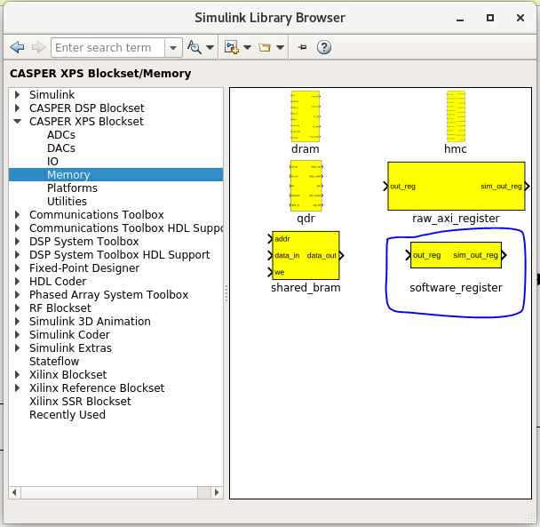

On one of the software_register blocks, set the I/O direction to *From Processor*. This will allow a value 
from the software to be sent to the FPGA hardware. This block will be the counter controller.

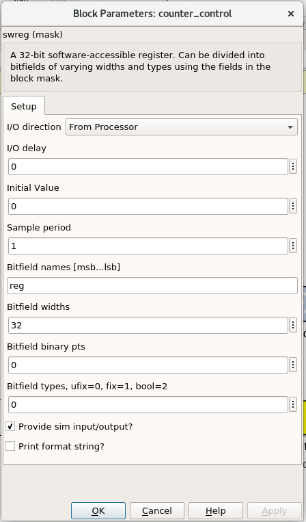

On the other software_register block, set the I/O direction to *To Processor*. This will allow the FPGA hardware
to send a value to the software when prompted. This block will be our counter reader.

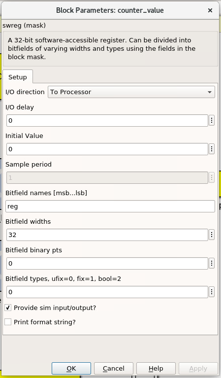

Set both registers to a bitwidth of 32 bits and rename them something sensible. The names of the blocks here
are the names used to access them from the software. Do not use spaces, slashes, or other funny characters for
these names. In this example, they are named `counter_control` and `counter_value`.

See that the registers have *sim* inputs and outputs. These allow you access the blocks in simulink for simulation
and test purposes. A *sim* input port can be fed inputs by simulink blocks, and a *sim* output port can be read by 
simulink blocks.

So that the counter runs during simulation, add a simulink constant block (found in Simulink->Sources->Constant),
set it to 1, and connect it to the *sim* input of the counter controller register. To monitor the counter's value
in simulation, add a simulink scope block (found in Simulink->Sinks->Scope) and connect it to the *sim* output of
the counter value register. 

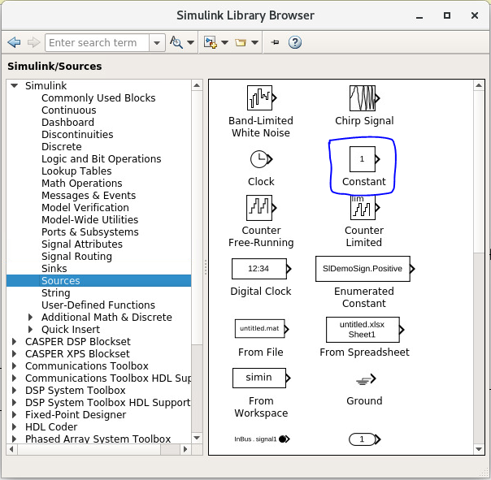

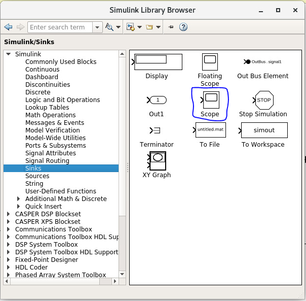

Note that these white simulink blocks will not be compiled to the fpga hardware. They
are for simulation purposes only. Only blue Xilinx blocks are acutally compiled. Yellow blocks are required to interface
white simulink blocks to the blue Xilinx blocks.

#### Step 2: Add the counter
Add another counter block the same way we did before. You can also copy the existing counter block by the usual
copy-paste or by ctrl-click-drag-drop. Open it's paramters and set it to free running, unsigned, 32 bits, with
synchronous reset port and enable port turned on.

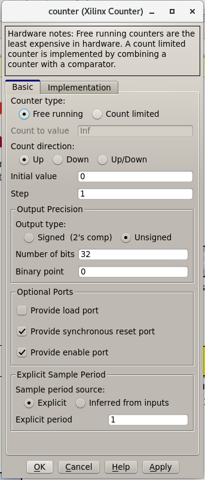

#### Step 3: Add the slice blocks
We want to be able to control the enable and reset ports on this new counter with the counter control register we
made before. We can do this by slicing out one bit of the register for the enable port and slicing out another bit
for the reset port. Alternatively, we could use two seperate registers, one for the reset and one for the enable,
but as the registers are 32 bits each, that would be wasteful.

Add 2 new slice blocks (or copy them from the flashing LED function). Configure one slice block for the enable by
setting it to boolean output, specifyin the range as Lower bit location + width, offset 0, and relative to LSB.

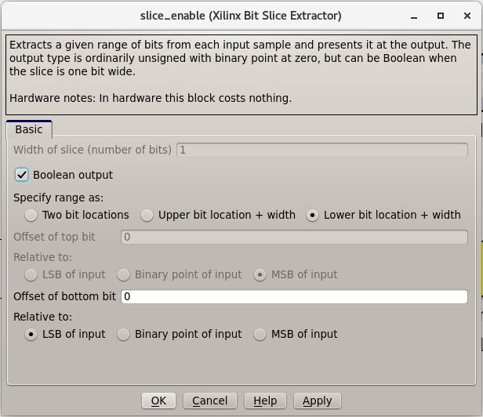

Configure the other slice block for the reset by doing the same thing, but setting the offset to 1.


#### Step 4: Connect the design
Connect the blocks together. Take time to make the design look neat as well, renaming and resizing blocks as needed.


And that concludes this counter!

### Function 3: Software Controllable Adder
The last function we will implement is a software controllable adder. We will be able to give the adder two value
over software, it will add in the hardware, and we will be able to read the result back using software.

#### Step 1: Add the software registers
Add two software registers and configure them as inputs (*From Processor*). These will let us specify the values 
to add. Add another register and configure it as an output (*To Processor*), so that we can read back the result. 
Name them something reasonable. Remember that the register names are how they will be accessed by the software.

#### Step 2: Add the adder block
Add a blue adder/subtractor block to the design, found in Xilinx Blockset->Math->AddSub. Check its configuration
and make sure it is set to addition.

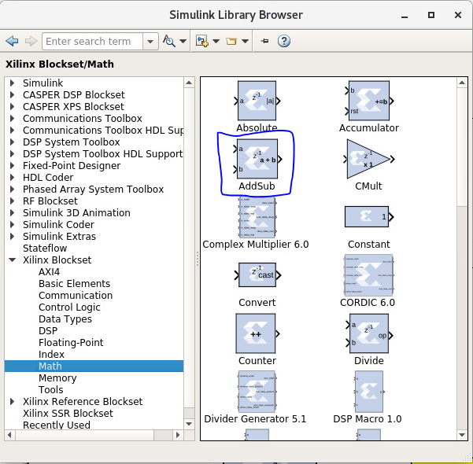

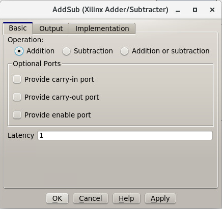

The output register is 32 bits. If we add two 32 bit numbers, we will have 33 bits.

There are a number of ways of fixing this:

 * limit the input bitwidth(s) with slice blocks
 * limit the output bitwidth with slice blocks
 * create a 32 bit adder.
 
For this example, we will configure the AddSub block to be a 32 bit adder. In its configuration, under the Output tab,
set it to unsigned 32 bits. Also set its overflow to Saturate. This way if two very large numbers are added, it will 
just return its max (2^32-1).

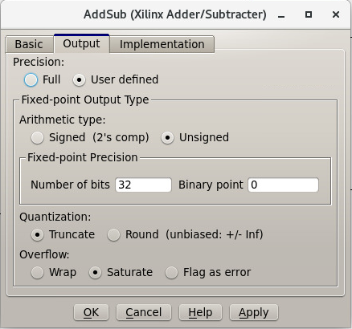

#### Step 3: Add the scope and simulation inputs
Add simulink scope and constant blocks to the output register and input registers. Set the constant blocks to something
so we can check the adder in simulation.

#### Step 4: Connect the design
Connect all the blocks together, name things properly, and adjust/resize the design so it's easy to look at. Of course,
these can all be done as you go, and probably should be done as you go.


Now the adder is done!

### Simulating the design


Now that everything has been designed and hooked up, we can simulate it within Simulink.

Under the simulate section of the simulation tab on the ribbon, set the stop time to the number of clock cycles you want
to simulate. This example uses 10. Note that (at least in MATLAB R2020b) it says that the stop time is in seconds, but 
this is actually clock cycles because of the way the toolflow and CASPER blocks are configured.


Press Run to simulate the design. Once the simulation is done, and assuming there are no errors, you can double click
the scopes to view the output signals. You should see the counter incrementing once every clock cycle and the adder
should show you the result of the addition. You may have to scale the scopes to see the results properly.

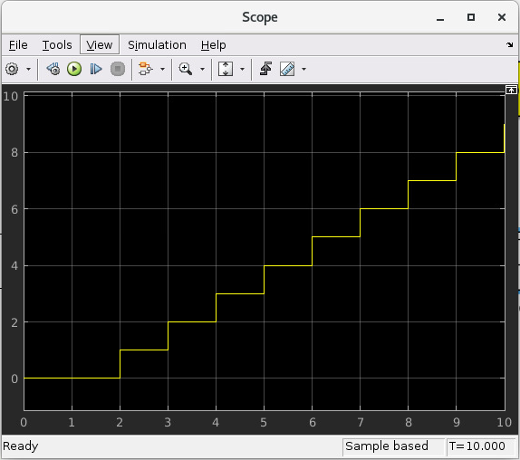

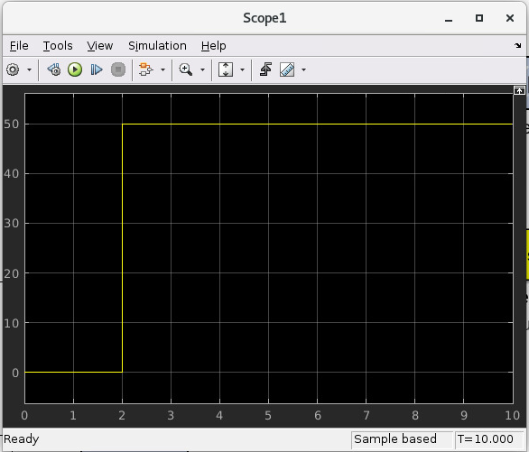

Once everything looks like it should, you're ready to compile for the FPGA!

## Compiling
We now have a design with 3 independent functions all working off the same FPGA clock. From here, compiling the design is
easy, so long as your environment was set up correctly.

To compile the design, go to the MATLAB command line and enter

```Matlab
>> jasper
```

You shouldn't have to do anything esle. This should work for any of the rfsoc boards.

The jasper command will run the various parts of the build process. The first part uses Xilinx's System Generator to compile
any Xilinx blocks in the design to a circuit that can be implemented on the FPGA, ie hdl code.

The second part runs Vivado's synthesis tools to create the physical implementation of the design for the board. Lastly, the
toolflow creates the final output .fpg file that is used to program the FPGA. The .fpg file contains the bitstream
that Vivado created as well as meta-data that describes the yellow blocks from the simulink design. The .fpg file
will be made the 'outputs' folder in teh working directory of the simulink model. The .fpg file will be named using
the simulink file name and the date/time that compilation begain. When putting together this example, compilation
took about 25 minutes.

## Programming the FPGA
Reconfiguring any CASPER boards is done by using the casperfpga python library. You should have installed and used this
in the Getting Started tutorial to check your connection to your board.

#### Step 1: Copy the .fpg file to where you need it
Navigate to the prevously mention 'outputs' folder and copy the .fpg file to wherever you are going to be running your 
ipython session from.

#### Step 2: Connect to the board
Assuming that your board is on, configured, and on the same network you're working on, connect to the board the same way
demonstrated in the Getting Started tutorial:

```bash
$ ipython
```

```python
In [1]: import casperfpga

In [2]: fpga = casperfpga.CasperFpga('ipaddress.of.board')

In [3]: fpga.is_connected()
Out[3]: True
```
If the output of `is_connect()` is true, you're good to go.

We can now program the fpga with the .fpg file with the following:

```python
In [4]: fpga.upload_to_ram_and_program('your_fpgfile.fpg')
```
## Interacting with the board
The design we created is now running on the board! You should see the first function working by observing the blinking LED
on the board. From here we can check to see if the software registers in the design worked. If you forgot what the
registers were named, you can use listdev() to get a list of available registers:

```python
In [5]: fpga.listdev()
Out[5]:
['a',
 'b',
 'counter_control',
 'counter_value',
 'sum_a_b',
 'sys_block',
 'sys_board_id',
 'sys_clkcounter',
 'sys_rev',
 'sys_rev_rcs',
 'sys_scratchpad']
 ```
 
 Let's test the adder function first. Reading and writing to the registers can be done with write_int() and read_int():
 ```python
 In [6]: fpga.write_int('a',15)

In [7]: fpga.write_int('b',35)

In [8]: fpga.read_int('sum_a_b')
Out[8]: 50
```

Lastly, let's test the controllable counter:

```python
In [9]: fpga.read_uint('counter_value')
Out[9]: 0

In [10]: fpga.write_int('counter_control',1)

In [11]: fpga.read_uint('counter_value')
Out[11]: 1103388123

In [12]: fpga.read_uint('counter_value')
Out[12]: 1849175237

In [13]: fpga.read_uint('counter_value')
Out[13]: 2590065552

In [14]: fpga.write_int('counter_control',0)

In [15]: fpga.read_uint('counter_value')
Out[15]: 1159837158

In [16]: fpga.read_uint('counter_value')
Out[16]: 1159837158

In [17]: fpga.write_int('counter_control',2)

In [18]: fpga.read_uint('counter_value')
Out[18]: 0
```

We can see that the counter starts at 0 and doesn't start counting until it receives the proper signal in the proper register.
We can also see that the counter wraps properly, and stops and resets as expected according the signals and registers we designed.
Note that read_uint() is used here to read the counter properly.

## Conclusion
In this tutorial, you've gone through the process of using `startsg` to initiate the toolflow, use simulink to create
a design, use `jasper` to compile and obtain a .fpg file, and use `casperfpga` to program and interact with your rfsoc board.
Congratulations!