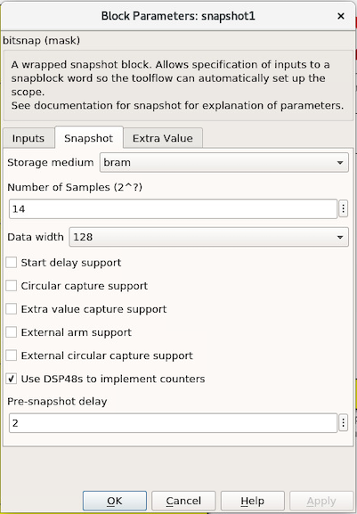
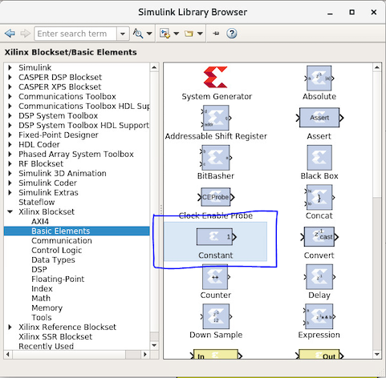

# Tutorial 2: The RFDC Interface

## Introduction
In this tutorial we introduce the RFDC Yellow Block and its configuration
interface with a simple design that captures ADC samples and places them in a
BRAM. Software control of the RFDC through `casperfgpa` is also demonstrated
with captured samples read back and briefly analyzed. This tutorial assumes you
have already setup your CASPER development environment as described in the
[Getting Started](./tut_getting_started.md) tutorial and are familiar with the
fundamentals of starting a CASPER design and communicating with your rfsoc board
using `casperfpga` from the [previous tutorial](./tut_platform.md).

Feature list of CASPER supported RFDC capabilities?

Reference PG269 for more details?

## The Example Design
In this example we will configure the RFDC to sample an RF signal in the range
of 1250 to 1750 MHz as to demonstrate the capabilities of the RFDC. There are a
few different ways this could be accomplished between the two different tile
architectures of the RFSoC on these platforms. However, in this tutorial we
target configuration settings that are as common as possible, use a various
number of the RFDC features, yet still be able to point out a some of the
differences between the quad- and dual- tile architectures of the RFSoC. Where
platform specific settings are required required beyond what is required as a
quad- or dual-tile RFSoC those differences will be identifed.

Where differences are required between the different platforms
  * Sample at 2000 Msps
  * output complex basebanded I/Q samples
  * deimcate by 4x
  * 

To get a picture of where we are headed, the final design will look like this for
quad-tile platforms:


And this for quad-tile platforms:


### Step 1: Add XSG and RFSoC platform yellow block

Add a Xilinx `System Generator` block and a platform yellow block to the design,
as demonstrated in [tutorial 1](../tut_getting_started.md). The examples in this
tutorial use the `ZCU216` platform, but the same steps for laying out the design
for other RFSoC platforms.

### Step 2: Place and configure the RFDC yellow block

Add an `rfdc` yellow block, found in `CASPER XPS Blockset->ADCs->rfdc`.


The `rfdc` yellow block automatically understands the target RFSoC part and
derives the corresponding tile architecture rendering the correct view. The
dual-tile architecture provides two ADC's per tile and the quad-tile providing
four. In this example we are targeting the ZCU216 which is a quad-tile
architecture rfsoc.

Configure the rfdc block as follows:


### Step 3: Update the platform yellow block

I didn't have to do anything here?

### Step 4: Place and configure the Snapshot blocks

Next we want to be able to take snapshots of the data the ADCs are producing. The green `bitfield_snapshot`
block from the CASPER DSP Blockset library can be used to do this.
Add a `bitfield_snapshot` block to the design, found in CASPER DSP Blockset->Scopes->bitfield_snapshot.
The block in the example has been renamed to snapshot1 after placement.


Configure the snapshot block as follows:





Now we need to hook up the snapshot our rfdc block. In its current configuration, the snapshot block
takes two data inputs, a write enable, and a trigger. Hook up the first two data output streams from
the rfdc (m00_axis_tdata and m10_axis_tdata) to the inputs of the snapshot block. Next, we're just going
to leave write enable hight, so add a *blue Xilinx* constant block (Xilinx Blockset->Basic Elements->Constant),
connect it to the snapshot `we` port, and configure it as follows:




A blue Xilinx block is used here instead of a white simulink block because we want the constant 1 to exist
in the synthesized hardware design.

Lastly, we want to be able to trigger the snapshot block on command. To do this, we will use a yellow 
`software_register` and a green `edge_detect` block (CASPER DSP Blockset->Misc->edge_detect).


Set the software_register to **From Software** and connect its output to the input of the edge_detect. Also,
name the register something sensible. In the example, it has been renamed snapshot_ctrl. Connect the output
of the edge_connect block to the trigger port on the snapshot block. Now when we write a 1 to the
software register, it will be converted into a pulse to trigger the snapshot block.

### Step 5: Validate the design

The design is now complete!


You can connect some simulink constant blocks to get rid of simulink unconnected port warnings, or leave them
if they don't bother your. Validate the design by running the simulation. In this case, there's nothing to see
in the simulation, so you could alternatively press `ctrl+d` to only update the diagram. Make sure to save!

### Step 6: Build!
As explained in tutorial 1, all you have to do to build the design is run the `jasper` command in the MATLAB
command window, assuming your environment was set up correctly and you started MATLAB by using the `startsg`
command. The toolflow will take over from there and eventually produce a .fpg file. When running this example,
synthesis took about 30 minutes.

However, now that we're using the rfdc block, we need an extra step. If you try to upload the .fpg file right now,
you'll notice that casperfpga will tell you it's missing a .dtbo file. To produce this file, do the following:

1. Go back to your MATLAB command window and scroll up to find the completion of the front end compile. If for
some reason you can't find it, you can just run `jasper_frontend`.
```
************************************
*    Front End compile complete    *
************************************
To complete your compile, run the following command in a terminal.
Remember to source your startsg.local environment first!
/opt/local/CASPER/pyenvs/casper-dev3/bin/python /home/bjacobm/mlib_devel/jasper_library/exec_flow.py -m /home/bjacobm/swiftprojects/tutorial2/tutorial2.slx --middleware --backend --software
****************************************
```

2. Copy the long command and go to a terminal. Remember to source startsg as mentioned by the toolflow. 
Paste the command, but wait, as we're going to edit it.

3. Edit the tags at the end of the command to the following:

```
--middleware --vitis --xsa ./directorytoyourthing/myproj/top.xsa
```

4. Run the modified command. It should produce the needed .dtbo file!

5. If the second part of the .dtbo file name (indicating the time of creation) is different than your 
.fpg file name, just the .dtbo to match. 

Ex: You have tutorial2_2021-80-02_1230.fpg and tutorial2_2021-80-02_1310.dtbo. Just change the .dtbo name
to tutorial2_2021-80-02_1230.dtbo to match the .fpg file.

Note about the output the .dtbo must follow the .fpg

## Testing the Design

Before starting this segment power-cycle the board. This is to force a hard
reset of the on-board rfpll clocking network. After the board has rebooted,
start IPython and establish a connection to the board using `casperfpga` in the
normal way.
```bash
$ ipython
```

```python
In [1]: import casperfpga

In [2]: alpaca1 = casperfpga.CasperFpga('192.168.2.101')

In [3]: alpaca1.upload_to_ram_and_program('/path/to/tut_rfdc.fpg')
```

This is our first design with the RFDC in it. When the RFDC is part of a CASPER
design the toolflow automatically includes meta information to indicate to
`casperfpga` that it should instantiate an `RFDC` object that we can use to
manipulate and interact with the software driver components of the RFDC.

```python
In [4]: alpaca1.adcs
Out[4]: ['rfdc']
```

We can create a reference to that `RFDC` object and begin to exercise some of
the software components included with the that object.

```python
In [5]: rfdc = alpaca1.adcs['rfdc']
```

We first initialize the driver; a doc string is provided for all functions and
so we can always use IPythons help `?` mechanism to get more information of a
methods signature and a brief description of its functionality.

```python
In [6]: rfdc.init?
Signature: rfdc.init(lmk_file=None, lmx_file=None, upload=False)
Docstring:
Initialize the rfdc driver, optionally program rfplls if file is present.

Args:
  lmk_file (string, optional): lmk tics hexdump (.txt) register file name
  lmx_file (string, optional): lmx tics hexdump (.txt) register file name
  upload (bool, optional): inidicate that the configuration files are local to the client and
    should be uploaded to the remote, will overwrite if exists on remote filesystem

Returns:
  True if completed successfully

Raises:
  KatcpRequestFail if KatcpTransport encounters an error
```

The `init()` method allows for optional programming of the on-board PLLs but, to
demonstrate some more of the `casperfpga` `RFDC` object functionality run
`init()` without any arguments. This simply initializes the underlying software
driver with configuration parameters for future use.

```python
In [7]: rfdc.init()
Out[7]: True
```

We can query the status of the rfdc using `status()`

```python
In [8]: rfdc.status()
ADC0: Enabled 1, State: 6 PLL: 0
ADC1: Enabled 1, State: 6 PLL: 0
ADC2: Enabled 1, State: 6 PLL: 0
ADC3: Enabled 1, State: 6 PLL: 0
Out[8]: True
```

the `status()` method displys the enabled ADCs, current "power-up sequence"
state information of the tile and the state of the tile PLL (locked, or not).
This information can be helpful as a first glance in debugging the RFDC should
the behavior not match the expected. The mapping of the `State` value to its
significance is found in [PG269 Ch.4, Power-on Sequence][pg269]. In this case
`6` indicates that the tile is waiting on a valid sample clock.

Note: `RFSoC2x2` only provides a sample clock to tile 0 and 1 and as it uses
a Gen 1 part that does not have the ability to forward sample clocks tiles 1 and
3 for that platform will always halt at `State: 6`.

As the board was power-cycled before programming any configuration of the
on-board PLLs was reset. To advance the power-on sequence state machine to
completion we need to program the PLLs. The `RFDC` object incorporates a few
helper methods to program the PLLs and manage the available register files:
`progpll()`, `show_clk_files()`, `upload_clk_file()`, `del_clk_file()`.

First take a look at `progpll()`:

```python
In [9]: rfdc.progpll?
Signature: rfdc.progpll(plltype, fpath=None, upload=False, port=None)
Docstring:
Program target RFPLL named by `plltype` with tics hexdump (.txt) register file named by
`fpath`. Optionally upload the register file to the remote

Args:
  plltype (string): options are 'lmk' or 'lmx'
  fpath (string, optional): local path to a tics hexdump register file, or the name of an
    available remote tics register file, default is that tcpboprphserver will look for a file
    called `rfpll.txt`
  upload (bool): inidicate that the configuration file is local to the client and
    should be uploaded to the remote, this will overwrite any clock file on the remote
    by the same name
  port (int, optional): port to use for upload, default to `None` using a random port.

Returns:
  True if completes successfuly

Raises:
  KatcpRequestFail if KatcpTransport encounters an error
```

To program a PLL we provide the target PLL type and the name of the
configuration file to use. Optionally, we can upload a file for later use. With
upload set to `False` this indicates that the target file already exists on the
remote processor for PLL programming. As the current CASPER supported RFSoC
platforms use various TI LMX/LMX chips as part of the RFPLL clocking
infrastructure the `progpll()` method is able to parse any hexdump export of a
TI TICS Pro file (the .txt formatted file).

`show_clk_files()` will return a list of the available clock files that are
available for reuse; The distributed CASPER image for each platform provides the
clock files needed for this tutorial. We use those clock files with `progpll()`
to initialize the sample clock and finish the RFDC power-on sequence state
machine. Follow the code relevant for your selected target

```python
# zcu216
In [10]: c = rfdc.show_clk_files()

In [11]: c
Out[11]: ['250M_PL_125M_SYSREF_10M.txt']

In [13]: rfdc_zcu111.show_clk_files()
Out[13]: ['122M88_PL_122M88_SYSREF_7M68_clk5_122M88.txt']

In [15]: rfdc_2x2.show_clk_files()
Out[15]: 
['rfsoc2x2_lmk04832_12M288_PL_15M36_OUT_122M88.txt',
 'LMX_REF_122M88_OUT_245M76.txt']

In [14]: rfdc_zrf16.show_clk_files()
Out[14]:
['zrf16_LMK_CLK1REF_10M_LMXREF_50M_PL_OUT_50M_nosysref.txt',
 'zrf16_LMX_REF_50M_OUT_250M.txt']

```


`upload_clk_file()` and `del_clk_file()` are available methods and used to
manage the clock files available for programming.

Note: All supported platforms already come available with...


[pg269]: https://www.xilinx.com/support/documentation/ip_documentation/usp_rf_data_converter/v2_4/pg269-rf-data-converter.pdf

